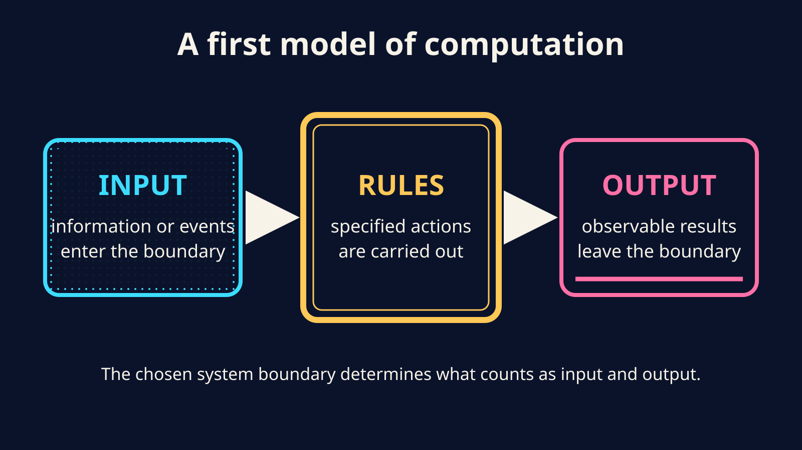
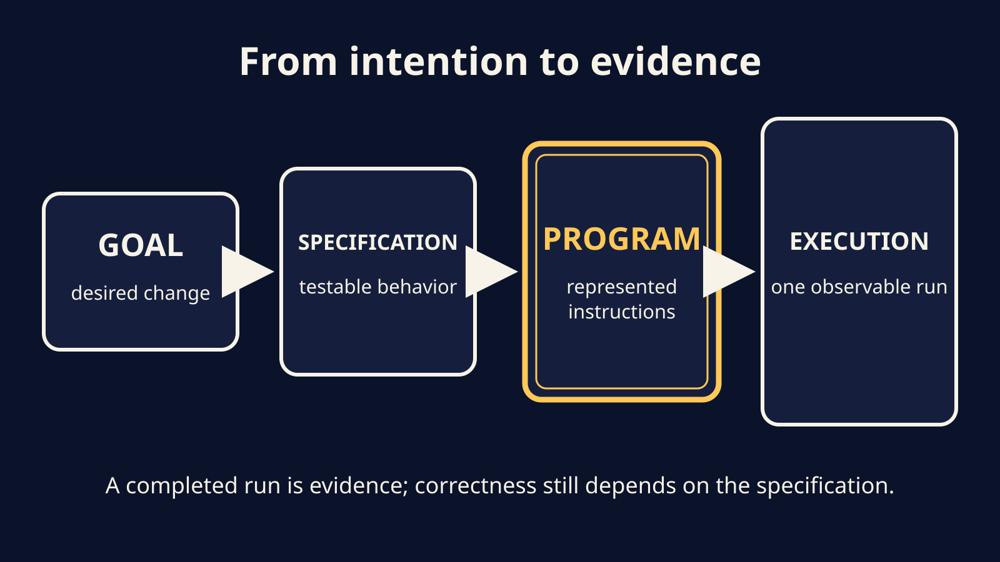
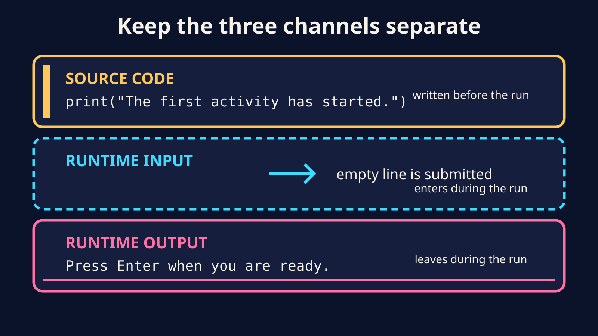

# L01 — Problems, inputs, outputs, and a first Python program

## What you will learn

After this lesson, you should be able to:

- distinguish a broad goal from a computational problem;
- identify inputs, outputs, and rules in a simple specification;
- explain the difference between a program and the system executing it;
- open, run, modify, and predict a tiny Python program;
- distinguish source code, information entered while the program runs, and output.

No programming experience is assumed.

## From a useful goal to an executable problem

“Make campus life better” is a worthwhile goal. It is not yet a problem a
computer can execute. What should change? What information is available? What
result should the system produce? How would we decide whether it succeeded?

Now choose one bounded task and compare it with this specification:

> Display `Welcome to Fundamentals of Computer Science.` Then display
> `Press Enter when you are ready.` and wait until a line is submitted. Finally,
> display `The first activity has started.`

The second request is still not a complete software specification, but it gives
us much more to test. It identifies ordered output, a point where input is
required, and observable waiting behavior.

For this course, a **computational problem** states accepted inputs, required
outputs, and constraints precisely enough for us to decide which results count
as correct. This is a useful working model, not the only possible definition of
computation. The problem states what must be achieved; a solution supplies a
method for achieving it.

Computers are powerful after a problem has been made sufficiently precise. They
do not decide for us what “better,” “fair,” or “helpful” should mean. Those are
human design questions with technical, social, and ethical consequences.

## The input–rules–output model

We can begin reasoning about a computation as a black box:



What counts as input or output depends on the system boundary we choose to study.

```text
input(s)  -->  rules carried out by an executor  -->  output(s)
```

- An **input** is information available to the computation. It might come from a
  keyboard, file, sensor, network, database, or earlier computation. Information
  embedded in source can influence behavior too; here we call it fixed source
  data rather than runtime input.
- The **rules** say what actions to perform. They must be precise enough for the
  chosen executor.
- An **output** is an observable result: text, an image, a stored file, a sound, a
  network message, or even a control signal sent to a physical device.

This model is deliberately simple. A running computation can also have changing
internal state, can interact repeatedly with its environment, and can fail. We
will add those ideas progressively.

### A specification checklist

Before writing code, ask:

1. What is the real goal?
2. Which inputs are available, and how are they represented?
3. Which outputs are required?
4. What relationship must connect input to output?
5. What cases or limits might violate our assumptions?
6. What observable evidence would count as success?

If an answer is missing, do not guess silently. Record the ambiguity and ask for
the missing decision.

## Program and executor

A **program** is a represented set of instructions. It does not act by itself,
just as a recipe does not cook by itself. Something must read the instructions,
maintain the relevant state, and perform the actions.

For our first examples, the instructions are Python source code. A Python system
executes that source for us. Later in the course we will open this black box and
distinguish the Python language, a particular Python implementation, operating-
system services, machine instructions, and hardware. For now, keep two things
separate:

```text
program:   represented instructions
executor:  the system that carries out those instructions
```



## First Python program

Open [hello.py](../code/hello.py):

```python
print("Hello, computer science!")
```

The source file contains one instruction using Python's `print()` action. When
the program runs, it produces this text output:

```text
Hello, computer science!
```

The quotation marks mark text in the source code; they are not part of the
displayed message. We will give values and text a precise treatment in L02.

Depending on your environment, you can use an editor's Run button or a terminal:

```console
python3 hello.py
```

On some Windows installations the command is `py hello.py`. Use the course
environment supplied by your instructor if one is provided.

## A program that interacts

Now open [welcome_pause.py](../code/welcome_pause.py):

```python
print("Welcome to Fundamentals of Computer Science.")
print("Press Enter when you are ready.")
input()
print("The first activity has started.")
```

Predict the order of events before running it:

1. The first `print()` produces a welcome message.
2. The second `print()` produces a readiness prompt.
3. `input()` waits for a line.
4. You press Enter, submitting an empty line as runtime input.
5. The final `print()` produces the start message.
6. There are no more instructions, so this run ends.

The prompt produced by `print()` is output. Pressing Enter tells the terminal to
submit a line; that submitted line is input to the program. Python makes the
entered information available as a value, but this program does not save or use
that value. That limitation is intentional. Soon we will learn how programs
represent values and remember them.

## Three channels that beginners often mix up

### 1. Source code

This is the text in the `.py` file, written before the run:

```python
print("The first activity has started.")
```

### 2. Runtime input

This is information supplied while that particular run is happening, such as the
empty line submitted when you press Enter while `input()` waits.

### 3. Runtime output

This is information the running program sends outward, such as the displayed
prompt and messages.

Changing the source changes future runs. Typing input affects the current run.
Reading output does not itself edit the program.



## Prediction is a programming habit

Before pressing Run, state what you expect to observe. Then run the program and
compare the actual behavior with your prediction. If they differ, that difference
is evidence—not a reason to guess repeatedly.

For a tiny program, trace one source line at a time:

| Next instruction | Observable event | Waiting or finished? |
| --- | --- | --- |
| first `print()` | welcome text appears | running |
| prompt `print()` | readiness prompt appears | running |
| `input()` | no new output | waiting for input |
| final `print()` | start text appears | running |
| no instruction remains | no new output | finished |

A program can run without reporting a syntax error and still produce the wrong
result. “It ran” and “it solved the stated problem” are different claims.

## Vocabulary

- **Problem:** a question or desired change that may still be informal.
- **Computational problem:** a problem represented precisely enough for rules to
  connect accepted inputs to required outputs.
- **Input:** information made available to a computation.
- **Output:** an observable result produced by a computation.
- **Program:** represented instructions for an executor.
- **Source code:** a human-readable representation of a program in a programming language.
- **Execution/run:** one occasion on which an executor carries out a program.
- **Runtime:** the period during a particular execution.
- **Specification:** a testable description of required behavior and constraints.

## Check yourself

1. Why is “make this app friendly” not yet a computational problem?
2. In the four-line example, which instruction produces the prompt and what
   information is input?
3. Is a Python source file the same thing as one run of that program? Explain.

## Bridge to L02

Our interactive program receives information but discards it. To do useful work,
the program needs values it can represent and operations it can perform on those
values. L02 begins with that problem.

## Primary references

- [Using the Python Interpreter](https://docs.python.org/3.14/tutorial/interpreter.html)
- [Python built-in `print()`](https://docs.python.org/3.14/library/functions.html#print)
- [Python built-in `input()`](https://docs.python.org/3.14/library/functions.html#input)
